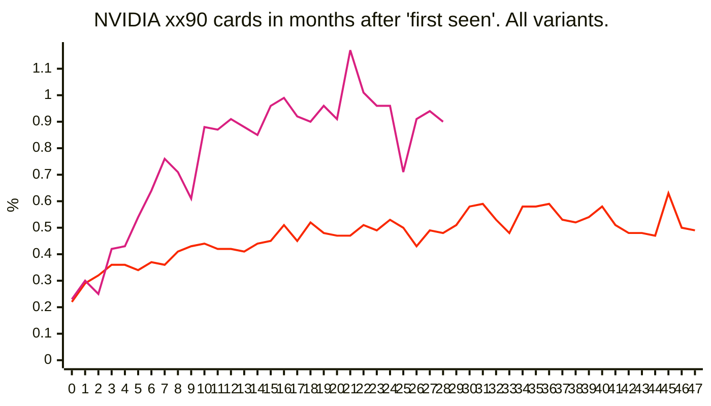
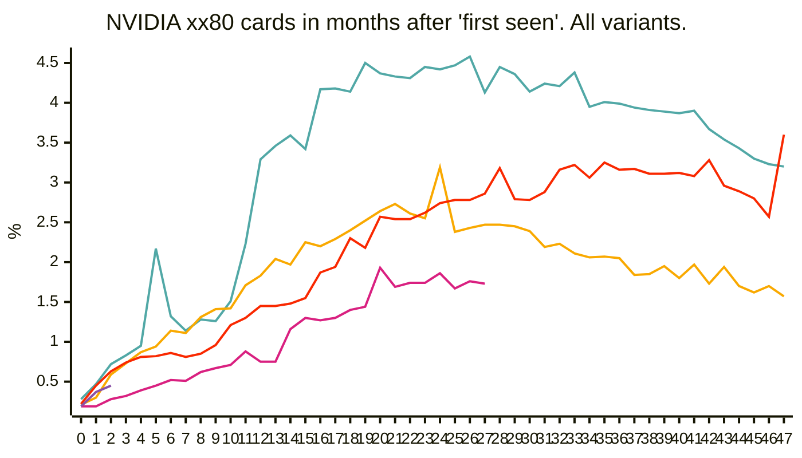
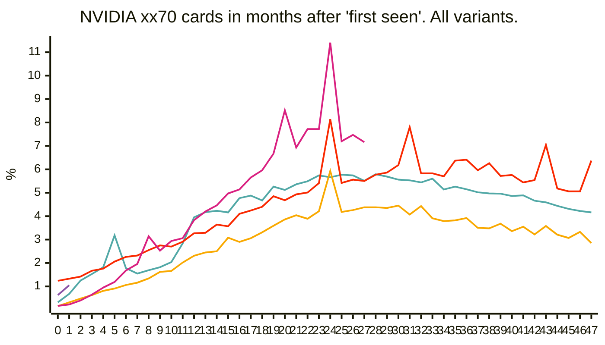

# birch-mapping
Mapping of Birch trees in German cities

This repo contains some additional data. For more details on the origin of the data visit [here](https://medium.com/p/97df710518fa) or on the mapping itself visit [here](https://medium.com/p/229b5f0087e1).

## GPUs 
### NVIDIA Generation Comparison

Compare GPUs across Generations, first month a GPU appears in Steam Hardware Survey = month 0.
Combines all variants, eg. 4060, 4060 Laptop GPU, 4060 Ti are all grouped in 4060.


$${\color{#51a8a6}--- \space\space\color{#f9a900}--- \space\space\color{#f92800}3090 \space\space\color{#d92080}4090 \space\space\color{#8a52a6}5090 \space\space}$$

<br/>


$${\color{#51a8a6}1080 \space\space\color{#f9a900}2080 \space\space\color{#f92800}3080 \space\space\color{#d92080}4080 \space\space\color{#8a52a6}5080 \space\space}$$

<br/>


$${\color{#51a8a6}1070 \space\space\color{#f9a900}2070 \space\space\color{#f92800}3070 \space\space\color{#d92080}4070 \space\space\color{#8a52a6}5070 \space\space}$$

<br/>

```mermaid
---
config:
    xyChart:
        width: 700
        height: 400
        
    themeVariables:
        xyChart:
            plotColorPalette: "#51a8a6,#f9a900,#f92800,#d92080,#8a52a6"

--- 


xychart-beta
    title "NVIDIA xx60 cards in months after 'first seen'. All variants."
    x-axis[0, '', '', '', '', '', 6, '', '', '', '', '', 12, '', '', '', '', '', 18, '', '', '', '', '', 24, '', '', '', '', '', 30, '', '', '', '', '', 36, '', '', '', '', '', 42, '', '', '', '', '']
    y-axis "%" 
    line [0.24, 0.9900000000000001, 1.47, 2.01, 6.3, 7.470000000000001, 11.29, 13.200000000000001, 14.610000000000001, 15.409999999999998, 14.05, 13.62, 11.88, 11.89, 12.33, 12.5, 13.309999999999999, 13.81, 14.299999999999999, 14.06, 14.799999999999999, 14.31, 15.310000000000002, 14.99, 15.690000000000001, 15.690000000000001, 15.5, 14.829999999999998, 14.42, 14.01, 14.44, 14.64, 15.790000000000001, 13.03, 12.23, 12.13, 11.459999999999999, 11.27, 11.27, 11.21, 10.75, 10.37, 10.48, 10.2, 11.31, 9.379999999999999, 9.19, 9.15]
    line [0.26, 0.51, 0.65, 0.8200000000000001, 0.9900000000000001, 1.23, 1.48, 1.6900000000000002, 2.1999999999999997, 2.63, 2.6, 2.66, 3.3099999999999996, 2.9200000000000004, 3.0400000000000005, 3.36, 3.52, 3.9699999999999998, 4.19, 4.34, 4.77, 6.9, 5.01, 5.24, 6.29, 6.35, 6.220000000000001, 7.199999999999999, 6.67, 8.020000000000001, 6.69, 6.24, 6.43, 6.659999999999999, 6.140000000000001, 6.35, 6.670000000000001, 6.039999999999999, 6.1, 5.94, 6.14, 5.92, 6.11, 7.089999999999999, 5.56, 5.62, 5.33, 5.64]
    line [0.25, 0.33, 0.36, 0.54, 0.8500000000000001, 1.38, 1.7000000000000002, 2.53, 2.9899999999999998, 3.2399999999999998, 3.9600000000000004, 4.7299999999999995, 4.760000000000001, 5.38, 6.039999999999999, 6.18, 6.529999999999999, 7.089999999999999, 7.62, 8.32, 9.3, 11.01, 9.94, 10.11, 10.43, 11.64, 18.42, 11.89, 12.33, 12.06, 11.649999999999999, 12.32, 13.750000000000002, 17.19, 12.129999999999999, 11.899999999999999, 11.89, 13.089999999999998, 13.600000000000001, 12.490000000000002, 13.0, 12.21, 12.08, 12.08, 12.09, 14.93, 10.93, 10.82]
    line [0.22999999999999998, 0.3, 0.79, 1.1199999999999999, 2.16, 2.87, 4.5200000000000005, 3.9900000000000007, 4.06, 4.87, 6.16, 6.800000000000001, 7.090000000000001, 7.71, 8.76, 9.22, 10.530000000000001, 12.229999999999999, 14.629999999999999, 11.530000000000001, 12.2, 12.25, 18.39, 11.959999999999999, 12.28, 11.690000000000001]
    line [0.2]
``` 
$${\color{#51a8a6}1060 \space\space\color{#f9a900}2060 \space\space\color{#f92800}3060 \space\space\color{#d92080}4060 \space\space\color{#8a52a6}5060 \space\space}$$

<br/>


