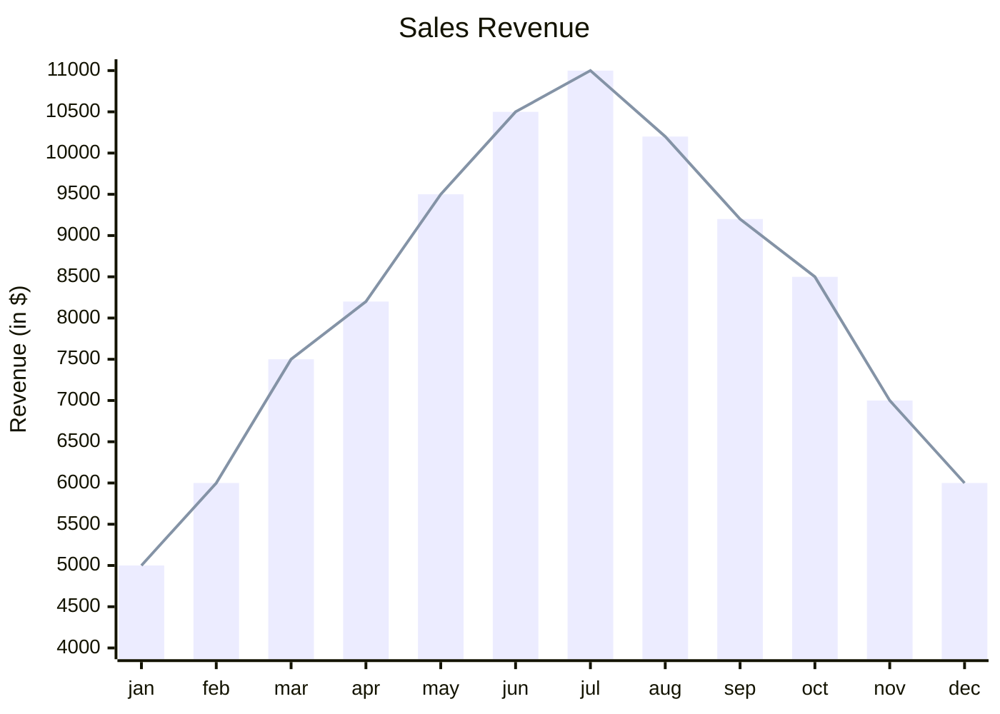
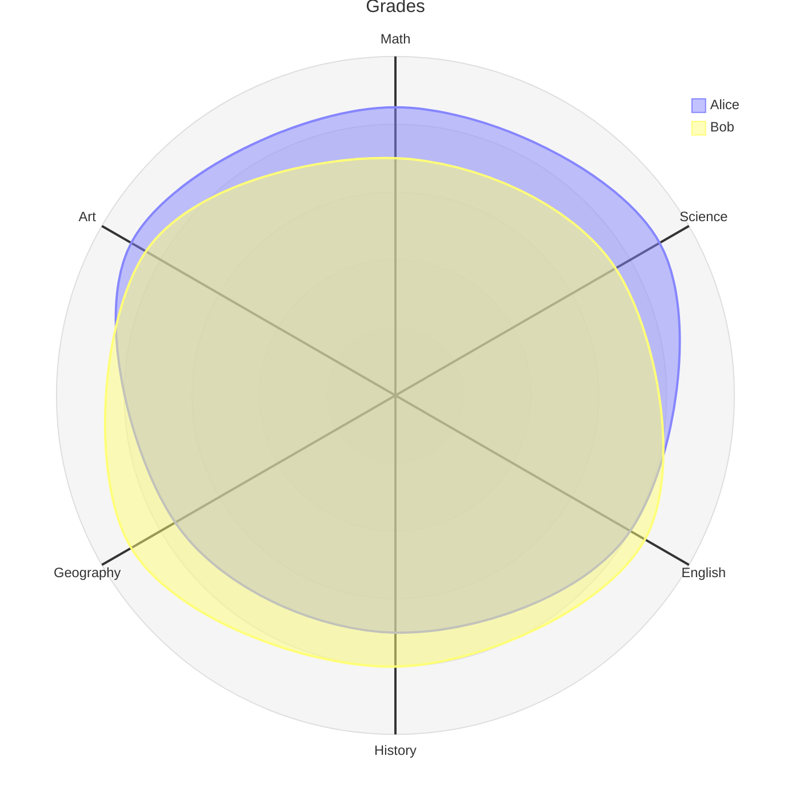

# birch-mapping
Mapping of Birch trees in German cities

This repo contains some additional data. For more details on the origin of the data visit [here](https://medium.com/p/97df710518fa) or on the mapping itself visit [here](https://medium.com/p/229b5f0087e1).

# Graph Tests

```mermaid
  info
```



